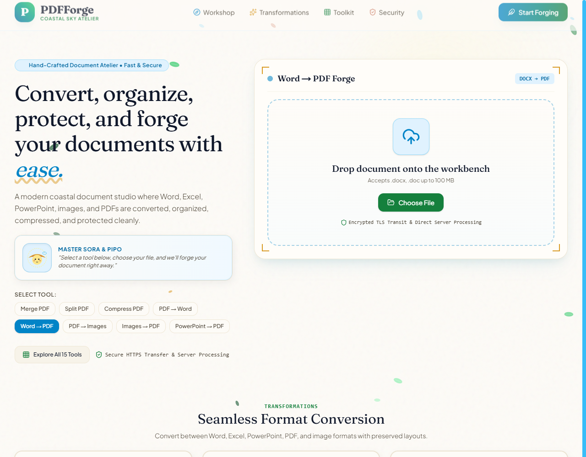
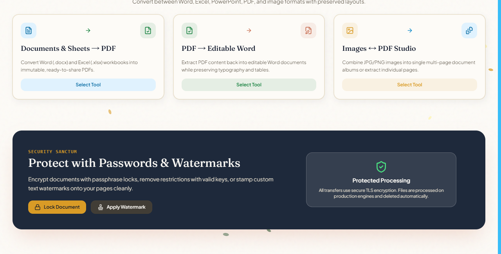
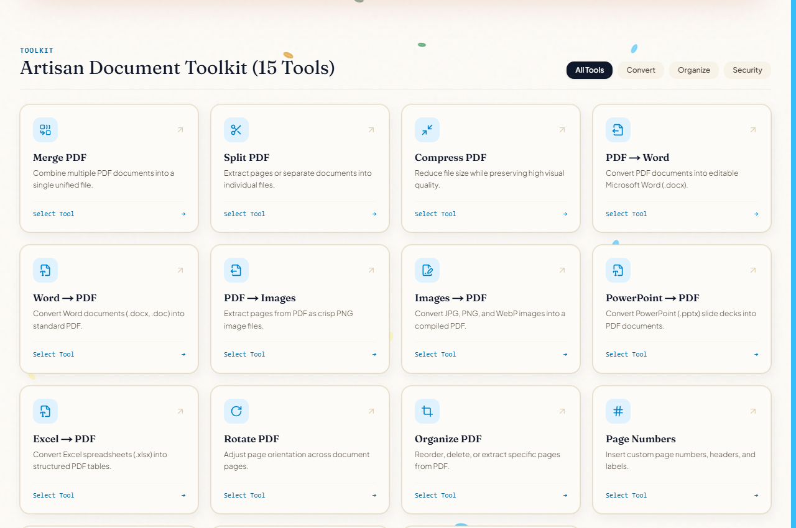
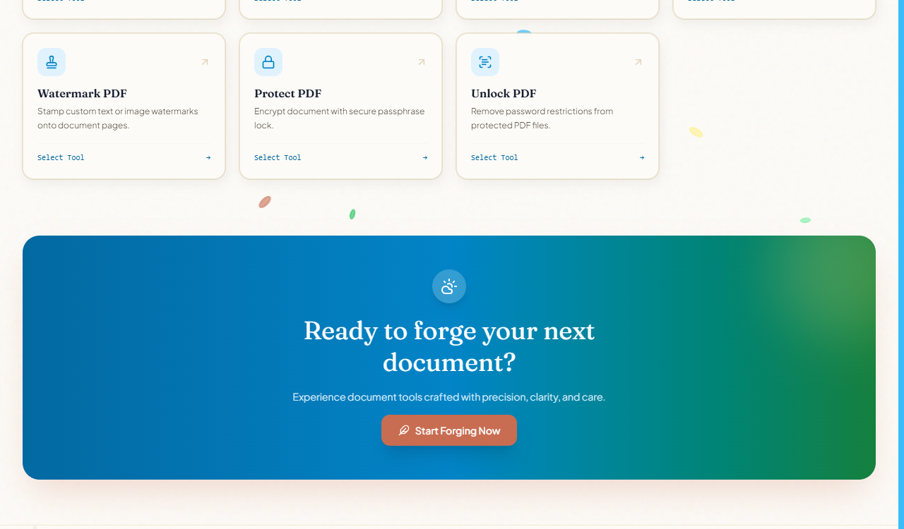

# PDFForge — Production-Grade SaaS PDF Toolkit

PDFForge is a high-performance, secure, and private PDF management SaaS web application built with **Next.js 16 (React 19)**, **Express 5**, **TypeScript**, **TailwindCSS 4**, **Framer Motion**, and **pdf-lib**.

---

## 🎨 Screenshots & Visual Interface

### Meadow Sky Atelier & PDF Workbench


### Format Conversion Showcase


### 15 Artisan Document Tools


### Security Sanctum (Password Encryption & Watermarking)


---

## 🌟 Features & Implemented Tool Suite

1. **Merge PDF** (`/merge`) — Combine multiple PDF files into one clean document in custom sequence.
2. **Split PDF** (`/split`) — Extract specific page ranges or split every page into standalone PDFs (ZIP download).
3. **Rotate PDF** (`/rotate`) — Rotate document pages by 90°, 180°, or 270°.
4. **Compress PDF** (`/compress`) — Optimize PDF streams and downsample embedded images for maximum file size reduction.
5. **Protect PDF** (`/protect`) — Encrypt PDF documents with password security and owner permissions.
6. **Unlock PDF** (`/unlock`) — Decrypt and remove password security from protected PDFs.
7. **Watermark PDF** (`/watermark`) — Overlay custom text stamps with configurable opacity, position, and rotation angle.
8. **Page Numbers** (`/page-numbers`) — Insert dynamic header/footer page numbering ("Page X of Y").
9. **Images to PDF** (`/images-to-pdf`) — Convert JPG, PNG, and WebP images into a unified PDF document.
10. **PDF to Images** (`/pdf-to-images`) — Extract PDF pages as high-resolution downloadable PNG images (ZIP package).
11. **Organize PDF** (`/organize`) — Delete unwanted pages, extract page subsets, and reorder pages in any sequence.
12. **Word to PDF** (`/word-to-pdf`) — Convert Word (.docx, .doc) files to PDF documents.
13. **PDF to Word** (`/pdf-to-word`) — Extract PDF text into editable Microsoft Word (.docx) documents.
14. **Excel to PDF** (`/excel-to-pdf`) — Convert Excel (.xlsx, .xls) spreadsheets to formatted PDF tables.
15. **PowerPoint to PDF** (`/powerpoint-to-pdf`) — Convert PowerPoint (.pptx, .ppt) slides to portable PDF documents.
16. **Convert Content** (`/convert`) — Convert raw HTML or plain text strings into clean paginated PDF documents.

---

## 📁 Repository Structure

```
ft/
├── frontend/                     # Next.js 16 App Router Frontend
│   ├── app/                      # Page routes (/merge, /split, /rotate, etc.)
│   ├── components/               # React components (hero, tools, pdf UI, site-nav)
│   ├── hooks/                    # Reusable client hooks (usePdfTool, useMergePdf)
│   ├── lib/                      # Constants, utility functions, pending file handoff
│   └── public/                   # Static icons & SVGs
├── backend/                      # Express.js TypeScript Backend Server
│   ├── src/
│   │   ├── config/               # Environment (Zod), CORS, Pino logger configuration
│   │   ├── core/                 # App errors, error-handler, rate-limiter, request-logger
│   │   ├── modules/
│   │   │   ├── health/           # Liveness & health check service
│   │   │   └── pdf/              # Controllers, routes, DTO schemas, upload middleware, services
│   │   └── server.ts             # Node HTTP server entrypoint & graceful shutdown
└── pnpm-workspace.yaml           # Monorepo workspace configuration
```

---

## 🚀 Quick Start & Local Setup

### Prerequisites
- Node.js `>=20.0.0`
- `pnpm` `>=9.0.0`

### Installation
```bash
# Install dependencies across all monorepo workspaces
pnpm install
```

### Running Locally
```bash
# Option A: Run both frontend and backend concurrently
pnpm dev

# Option B: Run backend dev server (Port 4000)
pnpm --dir backend dev

# Option C: Run frontend dev server (Port 3000)
pnpm --dir frontend dev
```

---

## 🔒 Security Hardening

- **Rate Limiting**: Configured global rate limits (`express-rate-limit`) to prevent brute force and DoS attacks (300 requests / 15 mins globally, 30 heavy PDF operations / minute).
- **Binary Magic Bytes Validation**: `upload.middleware.ts` inspects raw file binary headers (`%PDF-`, `\x89PNG`, `\xFF\xD8\xFF`) to stop MIME spoofing and malicious file uploads.
- **DTO Validation**: Zod schemas (`pdf.schemas.ts`) validate all request inputs (passwords, rotation angles, positions, page ranges).
- **Helmet & CORS**: Strict HTTP security headers and explicit CORS origin checks with exposed `Content-Disposition` and `Content-Length` headers.
- **In-Memory Processing**: File buffers are processed in memory and never persisted to unsafe disk locations.

---

## 🧪 Testing & Quality Assurance

```bash
# Run backend TypeScript typecheck
pnpm --dir backend typecheck

# Run backend unit test suite (Vitest)
pnpm --dir backend test

# Build frontend Next.js production bundle
pnpm --dir frontend build
```

---

## 📖 API Endpoint Documentation

All endpoints are mounted at `/api/pdf`:

| Endpoint | Method | Input Payload / Form Field | Description |
| :--- | :---: | :--- | :--- |
| `/api/pdf/merge` | `POST` | `files` (Multipart, min 2) | Combines multiple PDFs into a single document |
| `/api/pdf/split` | `POST` | `files` (Multipart, min 1), `pages` (string) | Extracts page ranges or returns a ZIP of single pages |
| `/api/pdf/rotate` | `POST` | `files` (Multipart, min 1), `rotation` (90/180/270) | Rotates document pages |
| `/api/pdf/organize` | `POST` | `files` (Multipart, min 1), `deletePages`, `pageOrder` | Deletes or reorders pages |
| `/api/pdf/protect` | `POST` | `files` (Multipart, min 1), `password` (string) | Encrypts PDF with password |
| `/api/pdf/unlock` | `POST` | `files` (Multipart, min 1), `password` (string) | Decrypts password-protected PDF |
| `/api/pdf/watermark` | `POST` | `files` (Multipart, min 1), `text`, `position`, `opacity` | Applies watermark text overlay |
| `/api/pdf/page-numbers` | `POST` | `files` (Multipart, min 1), `format`, `position` | Inserts page numbers ("Page X of Y") |
| `/api/pdf/images-to-pdf` | `POST` | `files` (Multipart, JPEG/PNG/WebP) | Converts images into a PDF document |
| `/api/pdf/pdf-to-images` | `POST` | `files` (Multipart, min 1) | Extracts PDF pages as PNG images (ZIP) |
| `/api/pdf/compress` | `POST` | `files` (Multipart, min 1), `quality` (low/medium/high) | Optimizes PDF streams |
| `/api/pdf/word-to-pdf` | `POST` | `files` (Multipart, `.docx`/`.doc`) | Converts Word documents to PDF |
| `/api/pdf/pdf-to-word` | `POST` | `files` (Multipart, PDF) | Converts PDF to editable Word (.docx) document |
| `/api/pdf/excel-to-pdf` | `POST` | `files` (Multipart, `.xlsx`/`.xls`) | Converts Excel spreadsheets to PDF tables |
| `/api/pdf/powerpoint-to-pdf` | `POST` | `files` (Multipart, `.pptx`/`.ppt`) | Converts PowerPoint slides to PDF |
| `/api/pdf/convert-html` | `POST` | `html` (JSON body) | Converts raw HTML/Text to PDF |

---

## 🌐 Deployment Guide

### Environment Variables
- `PORT`: Port number for backend (default: `4000`).
- `NODE_ENV`: `production` or `development`.
- `CORS_ORIGIN`: Allowed origins e.g. `https://pdfforge.app` or `*`.
- `NEXT_PUBLIC_API_BASE_URL`: Base API URL for frontend (e.g. `http://localhost:4000/api`).

### Production Build
```bash
# Build backend
pnpm --dir backend build

# Start backend server
pnpm --dir backend start

# Build frontend Next.js app
pnpm --dir frontend build

# Start frontend server
pnpm --dir frontend start
```
